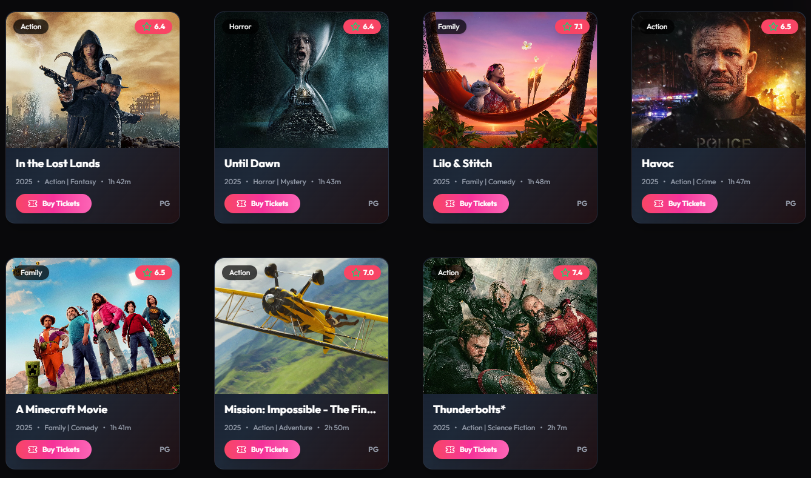
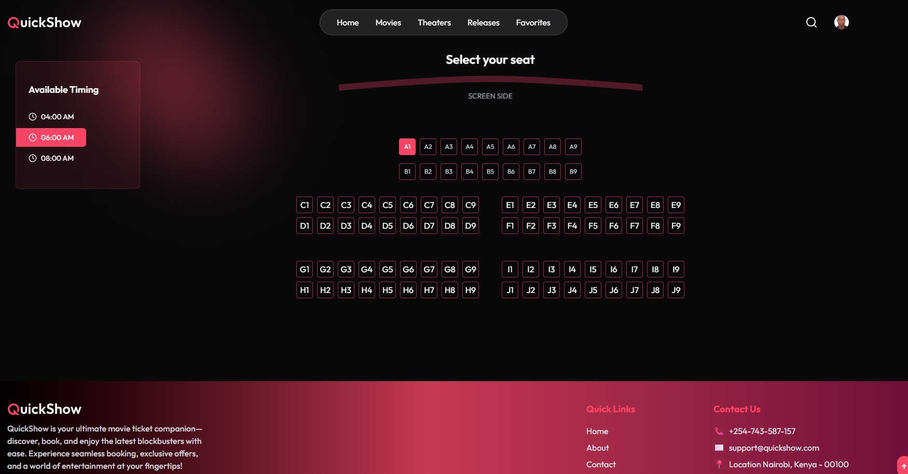

# QuickShow Movie Ticket App

QuickShow is a modern, responsive web application for discovering, booking, and managing movie tickets with ease. Built with React, it offers a seamless user experience for movie lovers to explore the latest blockbusters, view detailed movie information, select seats, and complete bookings—all in one place.

## Features

- 🎬 **Browse Movies:** Explore featured and trending movies with rich visuals and details.
- 📝 **Movie Details:** View movie overviews, ratings, genres, cast, and trailers.
- 🗓️ **Showtimes & Seat Selection:** Choose showtimes and select your preferred seats with an interactive layout.
- 💳 **Booking Flow:** Smooth checkout process for booking tickets.
- 🔔 **Newsletter Subscription:** Stay updated with the latest offers and movie releases.
- 📱 **Mobile Friendly:** Fully responsive design for all devices.
- 🌐 **Social Media Integration:** Quick links to follow QuickShow on popular platforms.

## Tech Stack

- **Frontend:** React, Tailwind CSS

## Getting Started

1. **Clone the repository:**
   ```bash
   git clonehttps://github.com/SonOfChrist/Movie-Ticket-Booking
   cd quickshow-movie-ticket-app/client
   ```

2. **Install dependencies:**
   ```bash
   npm install packages
   ```

3. **Run the app:**
   ```bash
   npm start
   npm run dev
   ```
## 🚀 User/Profile
- **Movie TicketApp**  
  
- **Movie Card**
   
- **SeatLayOut**
  

## Contributing

Contributions are welcome! Please open an issue or submit a pull request for improvements or bug fixes.

**Crafted with ❤️ by MochogeStanley**